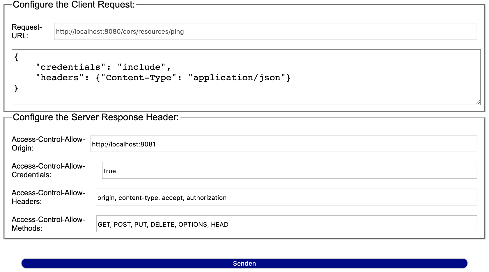

# Simple app to demonstrate CORS
This little app is meant to demo and explain CORS (responsibilities of the client as well as the server side in a CORS setup).

The setup is comprised of one application deployed two times to simulate different origins. The service listening on `http://localhost:8080` represents the server while `http://localhost:8081` acts as the client which wants to access resources of the foreign server-origin.

## How to build/start the app
To start everything up you just have to execute the `buildAndRun.sh` script which compiles the app, builds the docker-image and starts up two container instances named `cors-server` and `cors-client` respectively.

Prerequisites:
- Maven (v3.x) / Java (v8)
- Docker

## How to use the app

After both instances are up and running - head over to http://localhost:8081/cors where you can issue AJAX requests to the other origin.

With the pre-defined values you shouldn't have issues when fetching a resource from the other (here `http://localhost:8080`) origin. As a quick recap - the IMHO most important CORS headers are:

- `Access-Control-Allow-Origin`: can only be set to one specific origin which is allowed to fetch from this server. It can also be set to wildcard `'*'` but this value is __mutually exclusive__ to `"include"` credentials mode (which makes it useless when dealing with auth-cookies/headers).
- `Access-Control-Allow-Credentials`: _When a request's credentials mode (`Request.credentials`) is `"include"`, browsers will only expose the response to frontend JavaScript code if the `Access-Control-Allow-Credentials` value is `true` ([see here for more details][credentials])_
- `Access-Control-Allow-Methods`: all allowed methods which can be used in the actual fetch call 
- `Access-Control-Allow-Headers`: _Used in response to a preflight request to indicate which HTTP headers can be used when making the actual request._ Also allows wildcard `'*'` but again doesn't work with auth-cookies/header etc. 

Additionally, there's also a logging-filter which prints out the requests cookies (just to verify that the browser respects the `withCredentials`-flag)  

_Notice:_ When does all this apply? Whenever you access (i.e. via AJAX) resources of a different _origin_ - that means the destination differs in either the _protocol_, _domain_ or _port_ (and that also includes sub-domains). So, i.e.

- from `http://schoeffm.org` to `https://schoeffm.org` : you need CORS ('cause protocol differs)
- from `https://schoeffm.org` to `https://catalog.schoeffm.org` : you need CORS ('cause domain differs)
- from `https://schoeffm.org` to `https://schoeffm.org:8443` : you need CORS ('cause port differs)
- from `https://schoeffm.org/customer` to `https://schoeffm.org/catalog` : you don't need CORS

[fetch]:https://developer.mozilla.org/en-US/docs/Web/API/Fetch_API/Using_Fetch
[XHR]:https://developer.mozilla.org/en-US/docs/Web/API/XMLHttpRequest
[cors]:https://developer.mozilla.org/en-US/docs/Glossary/CORS
[credentials]:https://developer.mozilla.org/en-US/docs/Web/HTTP/Headers/Access-Control-Allow-Credentials